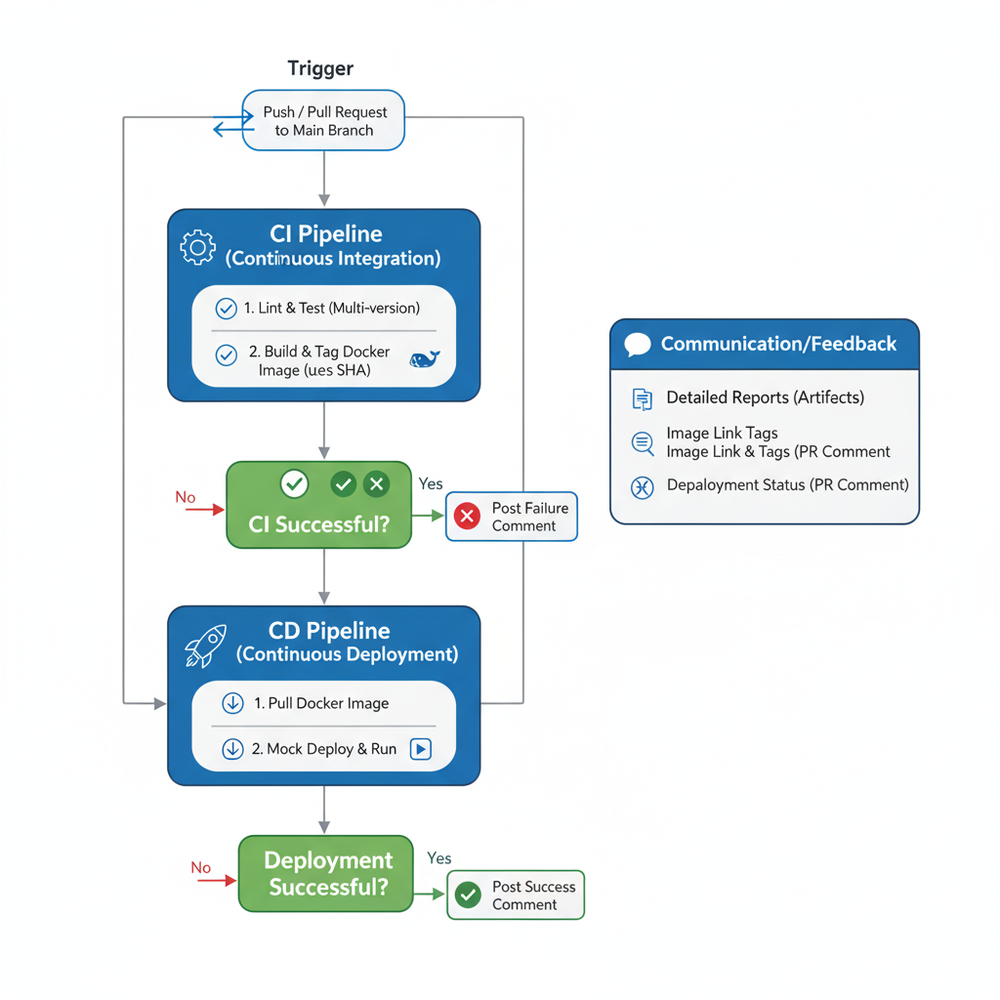

## 1. Pipeline Architecture Overview
The automation is structured around two modular and reusable GitHub Actions workflows: a `Continuous Integration (CI) pipeline` and a `Continuous Deployment (CD) pipeline`. A main "orchestrator" workflow triggers them in sequence.

Core Principles
- **Modularity:** CI and CD logic are separated into their own reusable workflows (`workflow_call`), making them easy to maintain and test independently.
- **Efficiency:** The pipeline is designed to provide feedback quickly. Concurrent execution is cancelled for new pushes to the same branch to save resources.
- **Clarity:** Jobs are clearly named, and outputs provide transparent feedback directly on pull requests.
- **Security:** Secrets are managed using GitHub's encrypted secrets and passed explicitly to reusable workflows, preventing accidental exposure.

## 2. Orchestrator Workflow (`00-ci-cd.yml`)
This is the main entry point for the entire process. Its sole responsibility is to orchestrate the execution of the CI and CD workflows.

#### Triggers
The pipeline activates on two events:
  - `push` to `main`: For direct commits to the main branch
  - `pull_request` to `main`: For proposed changes, including new commits to an existing PR (synchronize).

#### Jobs
  - `get_sha`:
    - **Purpose:** A simple, fast job to calculate the short commit SHA (7 characters).
    - **Output:** The short SHA is passed to downstream CI and CD jobs to ensure they operate on the correct commit and can tag Docker images consistently.

  - `ci` **(Continuous Integration)**:
    - **Purpose:** Triggers the reusable CI workflow (`01-ci-workflow.yml`).
    - **Dependencies:** `needs: get_sha`.
    - **Inputs Passed:** 
      - **github_sha:** The short commit SHA from the get_sha job.
      - **validate_pr:** A boolean (true/false) that tells the CI workflow if it was triggered by a pull request. This is used to control whether a PR comment is posted.
      - **Secrets Passed:** `DOCKERHUB_USERNAME` and `DOCKERHUB_TOKEN` are explicitly passed to authorize Docker Hub operations.
  
  - `cd` **(Continuous Deployment)**:
    - **Purpose:** Triggers the reusable CD workflow (0`2-cd-workflow.yml`).
    - **Dependencies:** `needs: [ci, get_sha]`.
    - **Execution Condition:** This job only runs if the `ci` job succeeds and the triggering event is a pull request (`if: ${{ needs.ci.result == 'success' && (github.event_name == 'pull_request') }})`.
    - **Inputs & Secrets:** Passes the short SHA and Docker Hub secrets, similar to the ci job.

## 3. Continuous Integration Workflow (`01-ci-workflow.yml`)

This workflow is the core of our quality assurance process. It lints, tests, and packages the application.

#### Jobs
  - `lint`:
    - **Responsibility:** Performs static code analysis using `flake8` to enforce code style and catch syntax errors early.
    - **Strategy:** Runs on a single, recent Python version (e.g., 3.12) for speed.
    - **test:**
      - **Responsibility:** Executes the automated test suite using pytest.
      - **Strategy:** It runs in a matrix across multiple Python versions (`3.10`, `3.11`, `3.12`) to ensure backward compatibility.

  - `test`:
    - **Responsibility:** Executes the automated test suite with pytest, calculates code coverage, and `posts a report as a comment on the Pull Request`.
    - **Strategy:** It runs in a matrix across multiple Python versions (3.10, 3.11, 3.12) to ensure compatibility.
    - **PR Feedback**: Each job in the matrix posts its own comment on the PR with the coverage percentage for its specific Python version. The script also updates existing comments to avoid spam on subsequent commits.

  - `build-and-push`:
    - **Responsibility:** Builds the application into a Docker image and pushes it to Docker Hub.
    - **Strategy:** This job runs only after the `test` job succeeds across all Python versions.
    - **Tagging Strategy:** The Docker image is tagged with:
      - The short commit SHA (e.g., repo/liquia_cicd:a1b2c3d).
      - `latest` if, and only if, the build is on the main branch.
    - **Output:** The generated image tags are passed as a job output.

  - `post-pr-comment`:
    - **Responsibility:** Posts a summary comment on the associated pull request.
    - **Execution Condition:** This job only runs if the `validate_pr` input is `true`.
    - **Comment Content:** Includes the Docker image tags, a link to the Docker Hub repository, the code coverage percentage, and a link to the workflow run to download the artifacts.

## 4. Continuous Deployment Workflow (02-cd-workflow.yml)
This workflow simulates a deployment process, ensuring the packaged Docker image is viable.

#### Jobs
  - `deploy`:
    - **Responsibility:** Pulls the specific Docker image built during the `CI` phase and runs it.
    - **Image Identification: It** reconstructs the image tag using the short commit SHA passed as an input.
    - **Mock Deployment:** The docker run command executes the container. A successful execution (exit code 0) is considered a successful mock deployment.
    - **PR Feedback:** Posts a final "`Deployment Succeeded`" or "`Deployment Failed`" comment to the pull request, providing closure on the entire `CI/CD` process for that change.
